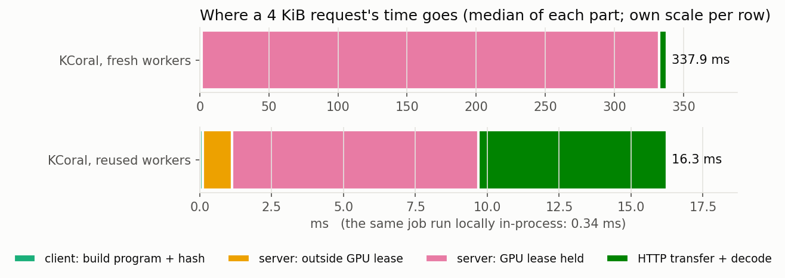
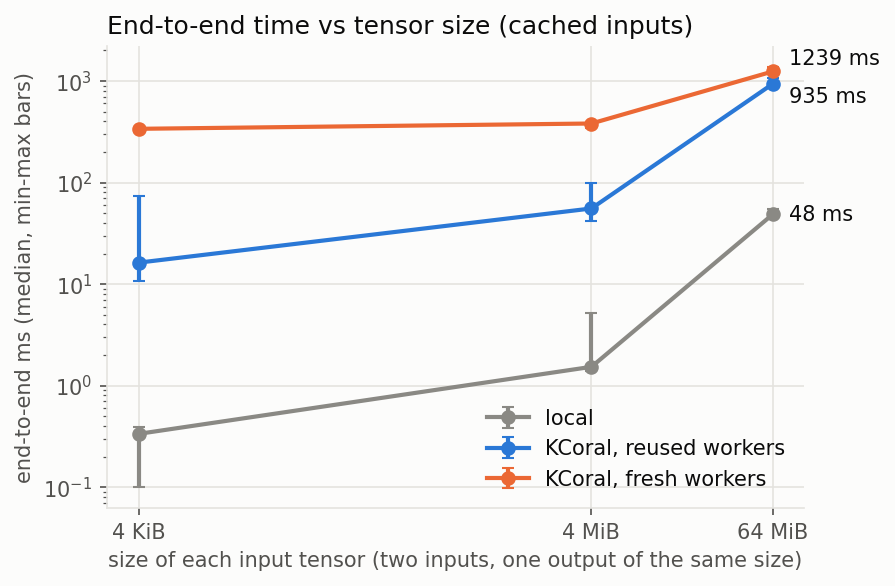
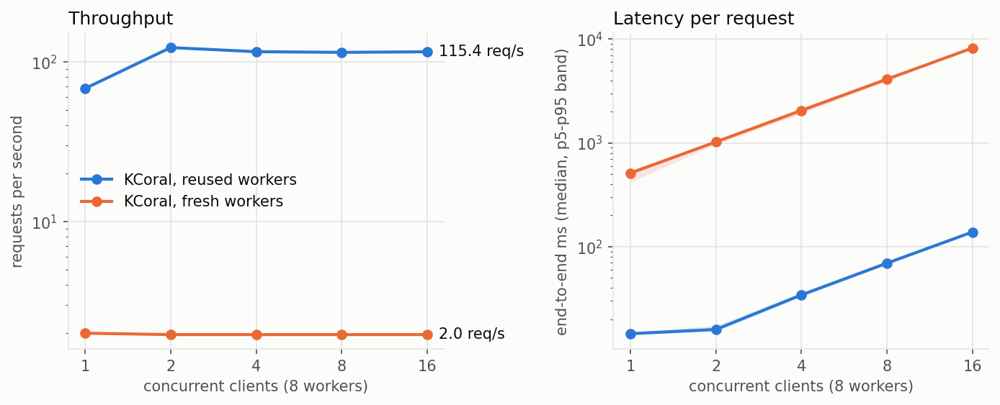

# KCoral overhead: preliminary report

KCoral runs benchmark programs on a remote GPU server. This report measures what
that costs compared with running the same job directly on the GPU. It uses the
simplest possible kernel (`c = a + b`, PyTorch, float32), so the kernel itself
does not hide the overhead.

The [KCoral blog post](https://blog.mlc.ai/2026/10/05/kcoral-lightweight-benchmark-server-for-agentic-gpu-programming)
already reports kernel-time **fidelity** on real kernels: across 500 TIRx-kernel
configurations on a B200, remote and local kernel times differed by 0.425% at the
median and 3.136% at p95. It also reports **throughput** on realistic workloads: 2.58×
faster than sequential local runs on a mixed workload, reaching 99.7% of the
practical bound. This report repeats the fidelity check on a different GPU, then
looks at what the post does not cover: the time KCoral adds to each request, where
that time goes, and the request rate one GPU can sustain when requests are short.

**Terms**

- **Fresh workers:** `--max-requests-per-worker 1`, the server default. Every
  request runs in a worker process that has never served a request, and the
  process exits after it.
- **Reused workers:** `--max-requests-per-worker 0`. Worker processes serve
  request after request.
- **Cached / new inputs:** whether the server's upload cache already holds the
  input tensors (keyed by SHA-256). With new inputs, the server first answers
  `CACHE_MISS` and the client resends the request with the tensor bytes.
- **GPU lease:** a worker's exclusive hold on its GPU. `lease_held_ms` and
  `lease_wait_ms` are reported by the server for each request.

## Setup

| | |
|---|---|
| GPU | NVIDIA GeForce RTX 2070 (sm_75, 8 GB, PCIe 3.0 x16), driver 595.58.03 |
| Host | AMD Ryzen Threadripper 3970X (32 cores), Ubuntu 24.04.4, Linux 6.8.0-139 |
| Software | Python 3.12, torch 2.14.0+cu130, TVM 0.27.0, KCoral `dfcf30c` |
| Server | `kcoral server` defaults on the same host as the client (loopback): 8 workers, one GPU. The **bubblewrap sandbox was off**, because AppArmor blocks unprivileged user namespaces on this host. |
| Dates | Q1–Q4: 2026-10-08. Q5 and Discussion: 2026-10-09. |

Method:
- The local and KCoral runs execute the same Python source.
- Each configuration repeats 50 times (end to end) or 30 times (kernel), with the
  modes interleaved inside each trial.
- Tables show **median [min, max]**. The JSON results also keep p5, p95 and mean.
- Unless stated otherwise, the client waits until all workers are ready before
  each KCoral request, so worker replacement is excluded. Q5 removes this wait.

## Open questions

1. **Q1.** Does running through KCoral change the measured kernel time?
2. **Q2.** How much time does one KCoral request add, and where does it go?
3. **Q3.** How does that cost grow with tensor size?
4. **Q4.** What does sending new inputs cost (upload cache miss, first request)?
5. **Q5.** How many requests per second can one GPU serve, and when do requests wait?

## Q1. Does running through KCoral change the measured kernel time?

**Experiment.** `overhead.py` runs `kcoral.builtins.benchmark` (CUPTI, L2 flush,
100 warm-up and 1000 timed calls) on the same `a + b`, once in the local process
and once inside a KCoral request. Each value below is the median of 30 such
runs, with min and max across those runs. Table: `report.py: q1_kernel_fidelity`.

| tensor | workers | local, µs | KCoral, µs | KCoral − local |
|---|---|---|---|---|
| 4 KiB | reused | 1.98 [1.98, 1.98] | 1.98 [1.98, 2.02] | +0.00 µs (+0.00%) |
| 4 KiB | fresh | 1.98 [1.73, 1.98] | 1.95 [1.70, 1.98] | −0.03 µs (−1.61%) |
| 4 MiB | reused | 33.50 [33.50, 33.54] | 33.60 [33.57, 33.60] | +0.10 µs (+0.29%) |
| 4 MiB | fresh | 33.50 [33.47, 33.50] | 33.47 [33.47, 33.50] | −0.03 µs (−0.10%) |
| 64 MiB | reused | 510.56 [510.00, 510.69] | 510.69 [510.40, 510.76] | +0.13 µs (+0.02%) |
| 64 MiB | fresh | 510.66 [510.21, 510.72] | 510.56 [510.34, 510.69] | −0.10 µs (−0.02%) |

**Answer.** No. Medians differ by at most 0.13 µs, with no consistent sign. That
is ≤0.3% at 4 MiB and 64 MiB. The 1.6% at 4 KiB is one 32 ns timer step on a
~2 µs kernel. This matches the blog post, where the only workloads above 5%
were 2 µs kernels.

## Q2. How much time does one KCoral request add, and where does it go?

**Experiment.** `overhead.py` with 4 KiB tensors, so data transfer is negligible.
- **Local in-process:** numpy → GPU, `a + b`, GPU → numpy, in a process whose
  CUDA context is already warm.
- **Local, new Python process:** the same job in a fresh interpreter.
- **KCoral:** build the program, then `client.execute` (upload the inputs, run,
  return `c`), with cached inputs.

The breakdown uses the server's timing fields and the client's own timers:
- **client: build program + hash:** the client's time before `execute`.
- **server: outside GPU lease:** server `elapsed_ms` minus `lease_held_ms`.
- **server: GPU lease held:** `lease_held_ms`.
- **HTTP transfer + decode:** the remaining wall time.

Figure: `report.py: q2_fixed_cost`.

| mode | end-to-end, ms |
|---|---|
| local, in-process | 0.34 [0.10, 0.39] |
| local, new Python process | 1779 [1718, 1814] |
| KCoral, reused workers | 16.3 [10.8, 73.4] |
| KCoral, fresh workers | 337.9 [315.6, 343.4] |

**Answer.**
- **Reused workers: ~16 ms per request.** About half is GPU lease time (8.6 ms):
  running the instructions plus per-request cleanup (synchronize, CUDA error
  check, state reset). Most of the rest is HTTP and decoding (6.5 ms).
- **Fresh workers: ~338 ms.** Lease time grows to 331 ms, almost all of it
  spent waiting for the retiring worker process to exit (see
  [Discussion](#why-a-fresh-worker-costs-320-ms)).
- Either way, a request is far cheaper than starting a new local Python
  process (1.8 s).

## Q3. How does that cost grow with tensor size?

**Experiment.** `overhead.py` with 4 KiB, 4 MiB and 64 MiB per tensor: two inputs
uploaded and one output of the same size returned. Inputs are cached. Figure and
table: `report.py: q3_size_scaling`.

Breakdown, ms (medians):

| tensor | workers | client: build + hash | server: outside lease | server: lease held | HTTP + decode | KCoral total | local |
|---|---|---|---|---|---|---|---|
| 4 KiB | reused | 0.1 | 1.0 | 8.6 | 6.5 | 16.3 | 0.36 |
| 4 KiB | fresh | 0.1 | 1.1 | 330.9 | 5.8 | 337.9 | 0.34 |
| 4 MiB | reused | 8.8 | 11.1 | 15.7 | 16.4 | 55.5 | 1.62 |
| 4 MiB | fresh | 9.0 | 16.9 | 342.8 | 13.3 | 381.1 | 1.53 |
| 64 MiB | reused | 135.7 | 493.9 | 126.9 | 175.1 | 934.7 | 46.31 |
| 64 MiB | fresh | 136.4 | 311.6 | 571.7 | 215.8 | 1239.0 | 48.47 |

**Answer.** With reused workers, data handling dominates from a few MiB up. With
fresh workers it takes over by 64 MiB. At 64 MiB per tensor, a reused-worker request takes 935 ms versus
46 ms locally:
- 136 ms: the client hashes 128 MiB of inputs (SHA-256, ~1 GB/s).
- ~490 ms: the server works outside the GPU lease.
- ~175 ms: the 64 MiB result is returned and decoded.

The ~490 ms server share is the largest single cost, and it has not been broken
down yet. Likely parts are reading the cached blobs, sending the tensors to the
worker process, and serializing the result. With fresh workers the split between
"outside lease" and "lease held" differs, which also needs a closer look.

## Q4. What does sending new inputs cost?

**Experiment.** In each `overhead.py` trial, the cached-input request is followed
by one with new tensor contents. That request misses the upload cache, gets
`CACHE_MISS`, and is resent with the bytes. "First request" is the run's first
request after server start, one sample per run, also with new inputs. Table:
`report.py: q4_new_inputs`.

| tensor | workers | cached inputs, ms | new inputs, ms | extra (median) | first request after start, ms |
|---|---|---|---|---|---|
| 4 KiB | reused | 16.3 [10.8, 73.4] | 20.3 [15.1, 21.6] | +4.0 | 39 |
| 4 KiB | fresh | 337.9 [315.6, 343.4] | 344.1 [324.9, 350.2] | +6.3 | 351 |
| 4 MiB | reused | 55.5 [41.5, 98.5] | 76.3 [53.1, 94.3] | +20.8 | 111 |
| 4 MiB | fresh | 381.1 [340.6, 392.3] | 404.8 [370.2, 439.3] | +23.7 | 436 |
| 64 MiB | reused | 934.7 [907.1, 1063.9] | 1289.8 [1196.5, 1402.4] | +355.2 | 1430 |
| 64 MiB | fresh | 1239.0 [1175.0, 1369.5] | 1654.6 [1591.4, 1755.2] | +415.5 | 1716 |

**Answer.** New inputs add one extra round trip plus the upload:
- **4 KiB:** +4–6 ms.
- **4 MiB:** +21–24 ms.
- **64 MiB:** +355–416 ms, about 3 ms per MiB uploaded over loopback.

The first request after server start was 7–140 ms slower than the new-input
median. There is no large first-request penalty, because workers set up CUDA
before the server reports ready.

## Q5. How many requests per second can one GPU serve, and when do requests wait?

**Experiment.** `throughput.py`: C clients (1–16) each send the 4 KiB request
with cached inputs back to back for 30 s. Requests that start in the first 5 s
are excluded. The client does **not** wait for workers between requests. The
server has 8 workers on one GPU. Figure and table: `report.py: q5_throughput`.

| workers | C | req/s | end-to-end ms: median [min, max] | queue ms (median) | lease wait ms (median) |
|---|---|---|---|---|---|
| reused | 1 | 68.1 | 15 [14, 19] | 0 | 0 |
| reused | 2 | 122.6 | 16 [13, 30] | 0 | 1 |
| reused | 4 | 115.6 | 34 [24, 101] | 0 | 18 |
| reused | 8 | 114.5 | 69 [42, 145] | 0 | 53 |
| reused | 16 | 115.4 | 138 [71, 231] | 62 | 59 |
| fresh | 1 | 2.00 | 512 [357, 631] | 121 | 0 |
| fresh | 2 | 1.96 | 1021 [874, 1134] | 634 | 0 |
| fresh | 4 | 1.96 | 2048 [1890, 2248] | 1658 | 0 |
| fresh | 8 | 1.96 | 4100 [3924, 4141] | 3714 | 0 |
| fresh | 16 | 1.96 | 8173 [8063, 8277] | 7781 | 0 |

**Answer.**
- **Reused workers: ~115 req/s from 2 clients up.** That matches 1 / 8.6 ms,
  the GPU lease time per request (Q2). The GPU lease is the bottleneck, so
  further clients only add lease wait, and latency grows linearly with C.
- **Fresh workers: 2 req/s, even with one client.** Every additional client
  adds ~0.5 s of queueing while waiting for a ready worker. A single client
  sending back to back already waits 121 ms per request. Two requests per second
  means ~0.5 s of GPU-exclusive work per request. That fits the request's own
  331 ms lease, which includes the worker exit, plus its replacement's
  initialization. Replacements initialize one at a time per GPU while holding
  the GPU lease (`Worker._abandon_and_respawn`, `GPULeases.initialization`).
  This split is inferred from the code and was not measured separately.
- The blog's throughput results use requests with seconds of GPU work, where
  this per-request cost is amortized. The 2 req/s ceiling matters for short
  requests: quick correctness checks, small kernels, or many agents polling one GPU.

## Discussion

### Why a fresh worker costs ~320 ms

When a worker retires, which with fresh workers means after every request, the
server waits for the worker process to exit before it sends the response. It
holds the GPU lease while it waits (`Worker._run_in_workspace` →
`_wait_for_exit`, `runtime/worker.py`). It then checks the exit code and
looks for orphaned child processes, so a crash during teardown fails the request.
`exit_time.py` times how long a warmed worker process takes to exit (10 runs each).
Table: `report.py: discussion_exit_time`.

| how the process ends | exit, ms (median) |
|---|---|
| normal exit (today) | 268 |
| SIGTERM (before #59) | 157 |
| `os._exit(0)`, skipping Python finalization | 158 |
| normal exit after destroying the CUDA context explicitly (the destroy itself: 78 ms) | 194 |

That splits the 268 ms roughly into:
- ~110 ms of Python finalization: atexit handlers and tearing down torch, TVM and CuTe DSL
- ~78 ms of CUDA context destruction
- ~80 ms of other OS and driver teardown

The supervisor's 20 ms polling (`_supervise_worker`) accounts for some of the
rest of the ~322 ms measured in Q2.

History:
- #102 made the response wait for a SIGTERM kill, so the GPU lease stays held
  until the context is gone.
- #59, which added multi-GPU support, replaced the kill with a graceful exit and
  exit checks that can fail the request, mainly for process trees.

Keeping the lease does not require delaying the response. One option is to
respond first and then tear down while still holding the lease, keeping today's
synchronous behaviour for `gpu_count` requests. That would cut ~0.3 s from each
fresh-worker request. It would not raise the 2 req/s ceiling, because the GPU
stays busy with teardown and replacement either way.

### What reused workers give up

Reused workers are ~20× cheaper per request (Q2) and serve ~58× more requests
per second (Q5), but requests share a process. `reuse_state.py` runs on one
reused worker. It inspects the worker, changes state in one request, inspects
again, then triggers a device-side assert and inspects the replacement. Table:
`report.py: discussion_reuse_state`.

| request | status | pid | GPU free, MiB | torch allocated, MiB | tensor on `torch` module | `Tensor.__add__` patched | `cudnn.benchmark` | env var |
|---|---|---|---|---|---|---|---|---|
| inspect | COMPLETED | 1802363 | 7686 | 0 | no | no | False | unset |
| change state | COMPLETED | 1802363 | 6918 | 256 | yes | yes | True | set |
| inspect | COMPLETED | 1802363 | 6918 | 256 | **yes** | **yes** | False | unset |
| fault | FAILED (`engine`) | — | — | — | — | — | — | — |
| inspect | COMPLETED | 1802599 | 7686 | 0 | no | no | False | unset |

**Restored between requests:** torch settings (`cudnn.benchmark`), environment
variables, and anything referenced only by the request itself.

**Carried into the next request:**
- objects attached to already-imported modules (the 256 MiB tensor)
- monkeypatches (`Tensor.__add__`)
- allocations outside torch: a raw 512 MiB `cuMemAlloc` stays allocated, which
  is why 768 MiB of GPU memory stays used
- the random number generator state, which is never reset by design

A fault that breaks the CUDA context is caught. The request fails, and the next
request runs in a fresh process with clean state. A fault that corrupts memory
without raising a CUDA error would not be caught. Side note: the device-side
assert was reported as error kind `engine` rather than `runtime`.

So fresh workers trade ~0.3 s per request and the 2 req/s ceiling for
isolation. That is reasonable for untrusted, possibly buggy kernels written by
agents. Reused workers suit trusted, high-volume work.
`--max-requests-per-worker N` is a middle ground that this report did not
measure.

## Summary

- **Q1.** KCoral does not change measured kernel time: medians within 0.13 µs.
- **Q2.** A request adds ~16 ms with reused workers and ~338 ms with the
  default fresh workers. The difference is the wait for the retiring worker
  process to exit.
- **Q3.** For large tensors, data handling dominates: +0.9 s at 64 MiB per tensor.
  The largest part, ~490 ms in the server outside the GPU lease, is not broken
  down yet.
- **Q4.** New inputs cost one extra round trip plus ~3 ms per MiB uploaded.
  There is no separate first-request penalty.
- **Q5.** One GPU serves ~115 req/s with reused workers, limited by GPU lease
  time, and 2 req/s with fresh workers, limited by worker exit and replacement,
  even with one client.

Candidate follow-ups for maintainers:
- respond before worker teardown (Discussion)
- break down the server's data handling for large tensors (Q3)
- measure `--max-requests-per-worker N`
- the `engine` error kind for device-side asserts

## Limitations

- **Sandbox off:** the bubblewrap sandbox was disabled, so its cost is not
  included.
- **Same host:** client and server ran on one host over loopback, with no real
  network.
- **One configuration:** one GPU model (RTX 2070, PCIe 3.0) and one simple
  PyTorch kernel.
- **Three sizes:** Q3 and Q4 use only three tensor sizes.

Reproduction steps and the file-to-section map are in [README.md](README.md).
